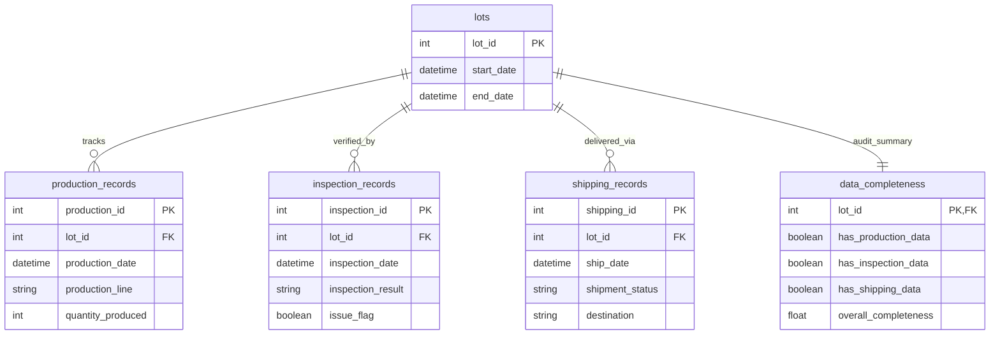

## lots
- lot_id (Primary Key)
- start_date
- end_date

## production_records
- production_id (Primary Key)
- lot_id (Foreign Key)
- production_date
- production_line
- quantity_produced

## inspection_records
- inspection_id (Primary Key)
- lot_id (Foreign Key)
- inspection_date
- inspection_result
- issue_flag (Boolean)

## shipping_records
- shipping_id (Primary Key)
- lot_id (Foreign Key)
- ship_date
- shipment_status
- destination

## data_completeness
- lot_id (Primary Key / Foreign Key)
- has_production_data (Boolean)
- has_inspection_data (Boolean)
- has_shipping_data (Boolean)
- overall_completeness

## Relationships
- One lots can have many production_records.
- One lots can have many inspection_records.
- One lots can have many shipping_records.
- One lots has one data_completeness.

## ERD

