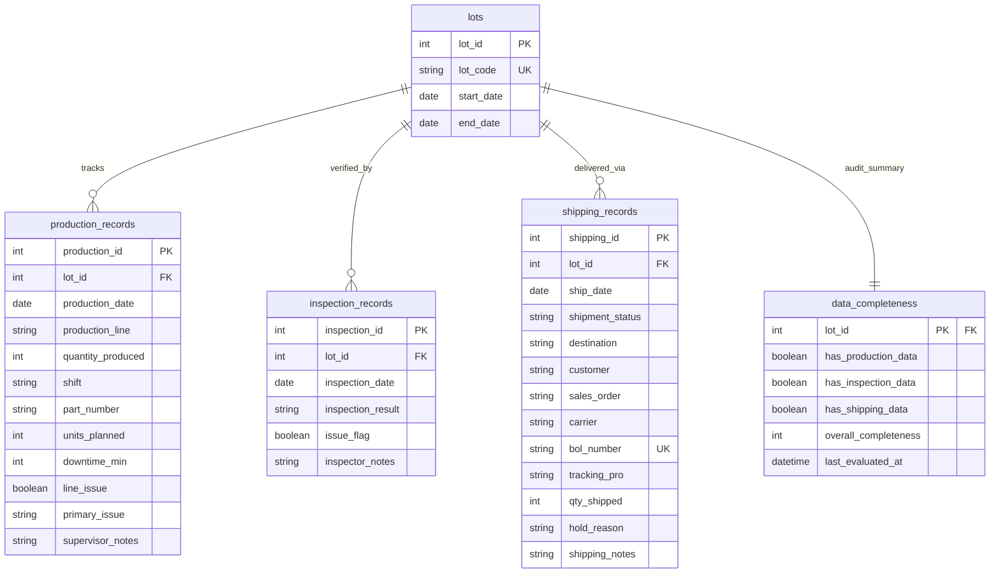

## lots
- lot_id (Primary Key)
- lot_code (Unique)
- start_date
- end_date (Optional — NULL while lot is still open)

## production_records
- production_id (Primary Key)
- lot_id (Foreign Key)
- production_date
- production_line
- quantity_produced
- shift
- part_number
- units_planned
- downtime_min (Default 0)
- line_issue (Boolean)
- primary_issue (Optional — only set when line_issue is true)
- supervisor_notes (Optional)

## inspection_records
- inspection_id (Primary Key)
- lot_id (Foreign Key)
- inspection_date
- inspection_result
- issue_flag (Boolean)
- inspector_notes (Optional)

## shipping_records
- shipping_id (Primary Key)
- lot_id (Foreign Key)
- ship_date
- shipment_status
- destination
- customer
- sales_order (Optional)
- carrier (Optional — NULL for customer pickup)
- bol_number (Optional, Unique)
- tracking_pro (Optional)
- qty_shipped (Default 0)
- hold_reason (Optional — required when shipment is On Hold)
- shipping_notes (Optional)

## data_completeness
- lot_id (Primary Key / Foreign Key)
- has_production_data (Boolean)
- has_inspection_data (Boolean)
- has_shipping_data (Boolean)
- overall_completeness (Integer percentage: 0, 33, 67, or 100)
- last_evaluated_at

## Relationships
- One lots can have many production_records.
- One lots can have many inspection_records.
- One lots can have many shipping_records.
- One lots has one data_completeness.

---

## ERD

